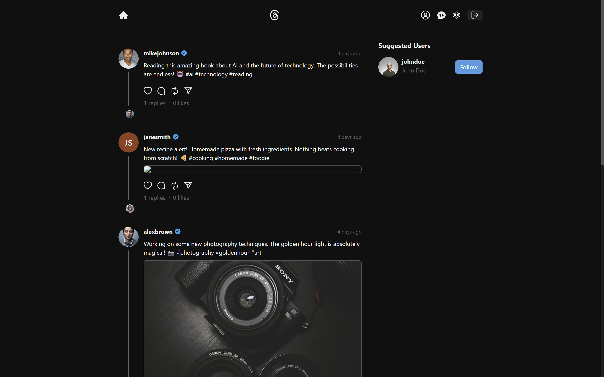

# Threads Clone

<p align="center">
  
</p>

## 🚀 Threads Clone – Real-Time Social App

Welcome to my full-stack Threads Clone! This project is a robust, production-ready social media platform built from scratch, featuring real-time chat, post interactions, and a modern, responsive UI. Every line of code, from backend to frontend, is crafted by me to deliver a seamless and engaging user experience.

---

### 🌟 Live Demo

👉 [View the App](https://threads-clone-two-omega.vercel.app/)

---

## 🛠️ Tech Stack

- **Frontend:** React.js, Vite, Chakra UI, Context API, Jotai
- **Backend:** Node.js, Express.js, MongoDB, Mongoose
- **Real-Time:** Socket.io
- **Authentication:** JWT, Secure Cookies
- **Deployment:** Vercel (Frontend), Render/Heroku (Backend)

---

## ✨ Features

- 🔐 **Authentication & Authorization** (JWT, secure cookies)
- 📝 **Create, Like, Comment, and Delete Posts**
- 💬 **Real-Time Chat** with image support
- 👀 **Seen/Unseen Message Status**
- 👥 **Follow/Unfollow Users**
- ❄️ **Freeze/Unfreeze Account**
- 🌓 **Dark/Light Mode**
- 🔔 **Notification Sounds**
- 📱 **Fully Responsive Design**
- ⭐ **Production Deployment**

---

## 📸 Screenshots

<p align="center">
  
</p>

---

## ⚡ Getting Started

### 1. Clone the repository
```bash
git clone https://github.com/Hmtgit7/threads-clone.git
cd threads-clone
```

### 2. Setup Environment Variables
Create a `.env` file in the `backend/` directory:
```
PORT=5000
MONGO_URI=your_mongodb_uri
JWT_SECRET=your_jwt_secret
CLOUDINARY_CLOUD_NAME=your_cloud_name
CLOUDINARY_API_KEY=your_api_key
CLOUDINARY_API_SECRET=your_api_secret
```

### 3. Install Dependencies
```bash
# Backend
cd backend
npm install

# Frontend
cd ../frontend
npm install
```

### 4. Run the App
```bash
# Start Backend
cd backend
npm start

# Start Frontend
cd ../frontend
npm run dev
```

---

## 🌐 Deployed Application
- **Frontend:** [threads-clone-two-omega.vercel.app](https://threads-clone-two-omega.vercel.app/)
- **Backend:** (Configure your backend deployment URL)

---

## 👨‍💻 About Me

I'm a passionate software engineer dedicated to building scalable, high-quality applications. I specialize in full-stack development, cloud architecture, and modern DevOps practices.

- Portfolio: [hemant-gehlod.netlify.app](https://hemant-gehlod.netlify.app/)
- GitHub: [Hmtgit7](https://github.com/Hmtgit7)

Let's connect and build something amazing together!

---

<p align="center">
  <b>Made with ❤️ by Hemant Gehlod</b>
</p>
